# Icônes

Les icônes disponibles affichées par la station le sont en fonction des codes ci-dessous.

On remarquera que plusieurs codes correspondent à la même icône, mais la plupart du temps le texte associé est différent. Ce texte est celui affiché par les stations supportant l'affichage d'un texte déroulant.

Les icônes présentées ici ont été recréées en utilisant la police [weather-icons](https://erikflowers.github.io/weather-icons/) et s'afficheront légèrement différemment selon votre station.

<table border=1 cellpadding=4 cellspacing=0>
    <tr>
        <td>Icône</td>
        <td>Code</td>
        <td>Texte</td>
    </tr>
    <tr>
        <td></td>
        <td>0x00</td>
        <td>ENSOLEILLE</td>
    </tr>
    <tr>
        <td rowspan=2></td>
        <td>0x01</td>
        <td>GENERALEMENT ENSOLEILLE</td>
    </tr>
    <tr>
        <td>0x41</td>
        <td>EN PARTIE BRUMEUX</td>
    </tr>
    <tr>
        <td></td>
        <td>0x02</td>
        <td>NUAGEUX A COUVERT</td>
    </tr>
    <tr>
        <td></td>
        <td></td>
        <td>NUAGEUX Note 1</td>
    </tr>
    <tr>
        <td rowspan=2></td>
        <td>0x03</td>
        <td>COUVERT</td>
    </tr>
    <tr>
        <td>0x83</td>
        <td>BRUMEUX</td>
    </tr>
    <tr>
        <td rowspan=4></td>
        <td>0x04</td>
        <td>NUAGEUX, ONDEES</td>
    </tr>
    <tr>
        <td>0x44</td>
        <td>NUAGEUX, CRACHIN VERGLACANT</td>
    </tr>
    <tr>
        <td>0x84</td>
        <td>NUAGEUX, AVERSES EPARSES</td>
    </tr>
    <tr>
        <td>0xC4</td>
        <td>NUAGEUX , GIBOULEES DE NEIGE EPARSES</td>
    </tr>
    <tr>
        <td rowspan=4></td>
        <td>0x05</td>
        <td>NUAGEUX, PLUIE</td>
    </tr>
    <tr>
        <td>0x45</td>
        <td>NUAGEUX, PLUIES VERGLACANTES</td>
    </tr>
    <tr>
        <td>0x85</td>
        <td>NUAGEUX, AVERSES</td>
    </tr>
    <tr>
        <td>0xC5</td>
        <td>NUAGEUX, GIBOULEES DE NEIGE</td>
    </tr>
    <tr>
        <td rowspan=4></td>
        <td>0x06</td>
        <td>NUAGEUX, AVERSES ABONDANTES</td>
    </tr>
    <tr>
        <td>0x46</td>
        <td>NUAGEUX, FORTES AVERSES</td>
    </tr>
    <tr>
        <td>0x86</td>
        <td>NUAGEUX, ABONDANTES PLUIES NEIGEUSES</td>
    </tr>
    <tr>
        <td>0xC6</td>
        <td>NUAGEUX, FORTES GIBOULEES DE NEIGE</td>
    </tr>
    <tr>
        <td rowspan=4></td>
        <td>0x07</td>
        <td>NUAGEUX A COUVERT, QUELQUES ONDEES</td>
    </tr>
    <tr>
        <td>0x47</td>
        <td>NUAGEUX A COUVERT, AVERSES EPARSES</td>
    </tr>
    <tr>
        <td>0x87</td>
        <td>NUAGEUX A COUVERT, FAIBLES PLUIES NEIGEUSES</td>
    </tr>
    <tr>
        <td>0xC7</td>
        <td>NUAGEUX A COUVERT, GIBOULEES DE NEIGE EPARSES</td>
    </tr>
    <tr>
        <td rowspan=4></td>
        <td>0x08</td>
        <td>NUAGEUX A COUVERT, PLUIE</td>
    </tr>
    <tr>
        <td>0x48</td>
        <td>NUAGEUX A COUVERT, AVERSES</td>
    </tr>
    <tr>
        <td>0x88</td>
        <td>NUAGEUX A COUVERT, PLUIES NEIGEUSES</td>
    </tr>
    <tr>
        <td>0xC8</td>
        <td>NUAGEUX A COUVERT, GIBOULEES DE NEIGE</td>
    </tr>
    <tr>
        <td rowspan=4>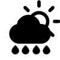</td>
        <td>0x09</td>
        <td>NUAGEUX A COUVERT, AVERSES ABONDANTES</td>
    </tr>
    <tr>
        <td>0x49</td>
        <td>NUAGEUX A COUVERT, FORTES AVERSES</td>
    </tr>
    <tr>
        <td>0x89</td>
        <td>NUAGEUX A COUVERT, ABONDANTES PLUIES NEIGEUSES</td>
    </tr>
    <tr>
        <td>0xC9</td>
        <td>NUAGEUX A COUVERT, FORTES GIBOULEES DE NEIGE</td>
    </tr>
    <tr>
        <td rowspan=4></td>
        <td>0x0A</td>
        <td rowspan=2>NUAGEUX, AVERSES EPARSES AVEC ORAGES</td>
    </tr>
    <tr>
        <td>0x8A</td>
    </tr>
    <tr>
        <td>0x4A</td>
        <td rowspan=2>COUVERT, AVERSES EPARSES AVEC ORAGES</td>
    </tr>
    <tr>
        <td>0xCA</td>
    </tr>
    <tr>
        <td rowspan=4></td>
        <td>0x0B</td>
        <td rowspan=2>NUAGEUX, AVERSES AVEC ORAGES</td>
    </tr>
    <tr>
        <td>0x8B</td>
    </tr>
    <tr>
        <td>0x4B</td>
        <td rowspan=2>COUVERT, AVERSES AVEC ORAGES</td>
    </tr>
    <tr>
        <td>0xCB</td>
    </tr>
    <tr>
        <td rowspan=4></td>
        <td>0x0C</td>
        <td rowspan=2>NUAGEUX, FORTES AVERSES AVEC ORAGES</td>
    </tr>
    <tr>
        <td>0x8C</td>
    </tr>
    <tr>
        <td>0x4C</td>
        <td rowspan=2>COUVERT, FORTES AVERSES AVEC ORAGES</td>
    </tr>
    <tr>
        <td>0xCC</td>
    </tr>
    <tr>
        <td>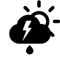</td>
        <td>0x0D</td>
        <td>NUAGEUX A COUVERT, AVERSES EPARSES AVEC ORAGES</td>
    </tr>
    <tr>
        <td></td>
        <td>0x0E</td>
        <td>NUAGEUX A COUVERT, AVERSES AVEC ORAGES</td>
    </tr>
    <tr>
        <td>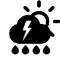</td>
        <td>0x0F</td>
        <td>NUAGEUX A COUVERT, FORTES AVERSES AVEC ORAGES</td>
    </tr>
    <tr>
        <td rowspan=4></td>
        <td>0x10</td>
        <td>NUAGEUX, FAIBLES CHUTES DE NEIGE</td>
    </tr>
    <tr>
        <td>0x50</td>
        <td>COUVERT, FAIBLES CHUTES DE NEIGE</td>
    </tr>
    <tr>
        <td>0x90</td>
        <td>NUAGEUX, AVERSES DE NEIGE EPARSES</td>
    </tr>
    <tr>
        <td>0xD0</td>
        <td>COUVERT, AVERSES DE NEIGE EPARSES</td>
    </tr>
    <tr>
        <td rowspan=4>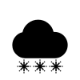</td>
        <td>0x11</td>
        <td rowspan=2>NUAGEUX, CHUTES DE NEIGE</td>
    </tr>
    <tr>
        <td>0x51</td>
    </tr>
    <tr>
        <td>0x91</td>
        <td>NUAGEUX, ABONDANTES CHUTES DE NEIGE</td>
    </tr>
    <tr>
        <td>0xD1</td>
        <td>NUAGEUX, FORTES AVERSES DE NEIGE</td>
    </tr>
    <tr>
        <td rowspan=4>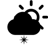</td>
        <td>0x12</td>
        <td>NUAGEUX A COUVERT, FAIBLES CHUTES DE NEIGE</td>
    </tr>
    <tr>
        <td>0x52</td>
        <td>NUAGEUX A COUVERT, AVERSES DE NEIGE EPARSES</td>
    </tr>
    <tr>
        <td>0x92</td>
        <td>NUAGEUX A COUVERT, ABONDANTES CHUTES DE NEIGE</td>
    </tr>
    <tr>
        <td>0xD2</td>
        <td>NUAGEUX A COUVERT, ABONDANTES AVERSES DE NEIGE</td>
    </tr>
    <tr>
        <td rowspan=3>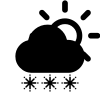</td>
        <td>0x13</td>
        <td>NUAGEUX A COUVERT,CHUTES DE NEIGE</td>
    </tr>
    <tr>
        <td>0x53</td>
        <td>NUAGEUX A COUVERT, AVERSES DE NEIGE</td>
    </tr>
    <tr>
        <td>0xD3</td>
        <td>COUVERT, TEMPETE DE NEIGE</td>
    </tr>
    <tr>
        <td rowspan=4></td>
        <td>0x14</td>
        <td rowspan=2>NUAGEUX, TEMPETE DE NEIGE</td>
    </tr>
    <tr>
        <td>0x94</td>
    </tr>
    <tr>
        <td>0x54</td>
        <td rowspan=2>COUVERT, TEMPETE DE NEIGE</td>
    </tr>
    <tr>
        <td>0xD4</td>
    </tr>
    <tr>
        <td rowspan=2></td>
        <td>0x15</td>
        <td>NUAGEUX, TEMPETE DE NEIGE</td>
    </tr>
    <tr>
        <td>0x55</td>
        <td>COUVERT, TEMPETE DE NEIGE</td>
    </tr>
    <tr>
        <td></td>
        <td>0x16</td>
        <td rowspan=2>NUAGEUX A COUVERT, TEMPETE DE NEIGE</td>
    </tr>
    <tr>
        <td>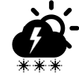</td>
        <td>0x17</td>
    </tr>
    <tr>
        <td></td>
        <td>0x18</td>
        <td>CIEL DEGAGE</td>
    </tr>
    <tr>
        <td rowspan=3></td>
        <td>0x19</td>
        <td>NUAGES EPARS</td>
    </tr>
    <tr>
        <td>0x59</td>
        <td>EN PARTIE BRUMEUX</td>
    </tr>
    <tr>
        <td>0x99</td>
        <td>NUAGEUX A COUVERT</td>
    </tr>
    <tr>
        <td rowspan=4></td>
        <td>0x1A</td>
        <td>NUAGEUX A COUVERT, PLUIES EPARSES</td>
    </tr>
    <tr>
        <td>0x5A</td>
        <td>NUAGEUX A COUVERT, AVERSES EPARSES</td>
    </tr>
    <tr>
        <td>0x9A</td>
        <td>NUAGEUX A COUVERT, FAIBLES PLUIES NEIGEUSES</td>
    </tr>
    <tr>
        <td>0xDA</td>
        <td>NUAGEUX A COUVERT, GIBOULEES DE NEIGE EPARSES</td>
    </tr>
    <tr>
        <td rowspan=4>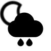</td>
        <td>0x1B</td>
        <td>NUAGEUX A COUVERT, PLUIE</td>
    </tr>
    <tr>
        <td>0x5B</td>
        <td>NUAGEUX A COUVERT, AVERSES</td>
    </tr>
    <tr>
        <td>0x9B</td>
        <td>NUAGEUX A COUVERT, PLUIES NEIGEUSES</td>
    </tr>
    <tr>
        <td>0xDB</td>
        <td>NUAGEUX A COUVERT, GIBOULEES DE NEIGE</td>
    </tr>
    <tr>
        <td rowspan=4>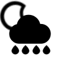</td>
        <td>0x1C</td>
        <td>NUAGEUX A COUVERT, PLUIES ABONDANTES</td>
    </tr>
    <tr>
        <td>0x5C</td>
        <td>NUAGEUX A COUVERT, FORTES PLUIES</td>
    </tr>
    <tr>
        <td>0x9C</td>
        <td>NUAGEUX A COUVERT, ABONDANTES PLUIES NEIGEUSES</td>
    </tr>
    <tr>
        <td>0xDC</td>
        <td>NUAGEUX A COUVERT, FORTES GIBOULEES DE NEIGE</td>
    </tr>
    <tr>
        <td>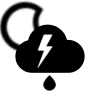</td>
        <td>0x1D</td>
        <td>NUAGEUX A COUVERT, AVERSES EPARSES AVEC ORAGES</td>
    </tr>
    <tr>
        <td></td>
        <td>0x1E</td>
        <td>NUAGEUX A COUVERT, AVERSES AVEC ORAGES</td>
    </tr>
    <tr>
        <td>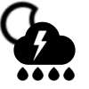</td>
        <td>0x1F</td>
        <td>NUAGEUX A COUVERT, FORTES AVERSES AVEC ORAGES</td>
    </tr>
    <tr>
        <td rowspan=2></td>
        <td>0x20</td>
        <td>NUAGEUX A COUVERT, FAIBLES CHUTES DE NEIGE</td>
    </tr>
    <tr>
        <td>0x60</td>
        <td>NUAGEUX A COUVERT, GIBOULEES DE NEIGE EPARSES</td>
    </tr>
    <tr>
        <td rowspan=4>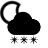</td>
        <td>0x21</td>
        <td>NUAGEUX A COUVERT,CHUTES DE NEIGE</td>
    </tr>
    <tr>
        <td>0xA1</td>
        <td>NUAGEUX A COUVERT, ABONDANTES CHUTES DE NEIGE</td>
    </tr>
    <tr>
        <td>0x61</td>
        <td>NUAGEUX A COUVERT, PLUIES NEIGEUSES</td>
    </tr>
    <tr>
        <td>0xE1</td>
        <td>NUAGEUX A COUVERT, FORTES AVERSES DE NEIGE</td>
    </tr>
    <tr>
        <td></td>
        <td>0x22</td>
        <td rowspan=2>NUAGEUX A COUVERT, TEMPETE DE NEIGE</td>
    </tr>
    <tr>
        <td>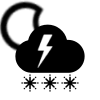</td>
        <td>0x23</td>
    </tr>
</table>

Note 1: Cette icône et le texte associé sont décrits dans le manuel de certaines stations, mais aucun code n'a pu être identifié pour l'obtenir sur l'affichage d'une station de test.