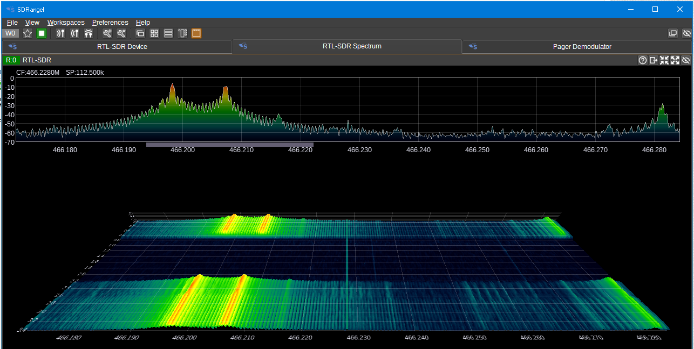

# Protocole

L'identification des éléments constituant ce protocole de transmission a été rendu possible par le travail de plusieurs membres du forum [TetraHub](https://forum.tetrahub.net/decodage-meteo/)

- [Protocole](#protocole)
  - [Généralités](#généralités)
  - [Niveau physique](#niveau-physique)
  - [Niveau Réseau](#niveau-réseau)
  - [Niveau présentation](#niveau-présentation)
  - [Niveau application](#niveau-application)
    - [Date/Heure + Départements (0xF)](#dateheure--départements-0xf)
      - [Date et heure](#date-et-heure)
      - [Intervalle d'écoute](#intervalle-découte)
      - [Départements](#départements)
    - [Prévisions météo longues (0x0)](#prévisions-météo-longues-0x0)
      - [Températures et icônes](#températures-et-icônes)
      - [Probabilité de pluie](#probabilité-de-pluie)
    - [Prévisions météo courtes (0x4)](#prévisions-météo-courtes-0x4)
    - [Trame inconnue (0xE)](#trame-inconnue-0xe)

## Généralités

Les messages reçus par la station sont émis selon le protocole POCSAG qui était utilisé par les pagers à la grande époque où ça servait encore.

## Niveau physique

La transmission se fait par modulation de fréquence (FSK) sur une porteuse à 466.206250 MHz et une déviation de 4 kHz

ATTENTION: La polarité choisie pour les bits 1 et 0 doit être la bonne sinon la station ignore le contenu reçu.

Avec un analyseur de spectre, on doit observer ceci:



## Niveau Réseau

Le message POCSAG doit utiliser les paramètres suivants :

* RIC = 25176
* Fonction = 3
* Mode alphanumérique

Le reste du découpage en batch, les mots de synchronisation et de veille sont ceux par défaut du protocole POCSAG.

## Niveau présentation

Chaque caractère présent dans le message correspond à 6 bits selon cette correspondance:

| Valeur | Caractère |
|---|---|
| 3 | s |
| 32 | p |
| 59 | k |
| 60 | l |
| 61 | m |
| 62 | n |
| 63 | o |
| 0-2; 4-31; 33-58 | 32 + valeur <sup>*</sup> |

<sup>* *le résultat de l'opération est le code [ASCII](https://ascii-table.net/) du caractère à utiliser*</sup>

Les valeurs sur 6 bits sont ensuite à répartir par groupe de 4 afin de créer des trames de quartets (nibbles) dans l'ordre des bits lus :

<table border=1 cellpadding=4 cellspacing=0>
    <tr>
        <td>Bit</td>
        <td>0</td>
        <td>1</td>
        <td>2</td>
        <td>3</td>
        <td>4</td>
        <td>5</td>
        <td>6</td>
        <td>7</td>
        <td>8</td>
        <td>9</td>
        <td>10</td>
        <td>11</td>
        <td>12</td>
        <td>13</td>
        <td>14</td>
        <td>15</td>
        <td>16</td>
        <td>17</td>
        <td>18</td>
        <td>19</td>
        <td>20</td>
        <td>21</td>
        <td>22</td>
        <td>23</td>
    </tr>
    <tr>
        <td>Caractère</td>
        <td colspan=6 align="center">0</td>
        <td colspan=6 align="center">1</td>
        <td colspan=6 align="center">2</td>
        <td colspan=6 align="center">3</td>
    </tr>
    <tr>
        <td>Quartet</td>
        <td colspan=4 align="center">0</td>
        <td colspan=4 align="center">1</td>
        <td colspan=4 align="center">2</td>
        <td colspan=4 align="center">3</td>
        <td colspan=4 align="center">4</td>
        <td colspan=4 align="center">5</td>
    </tr>
</table>

## Niveau application

Plusieurs types de trames ont été identifiés, seuls certaines sont utilisées dans ce projet afin de fournir un fonctionnement minimaliste.

En particulier, l'envoi d'alertes de vigilance n'est pas encore compris.

Toutes les trames commencent par un quartet d'identification et la plupart incluent une somme de contrôle pour certains éléments.<br/>
Cette somme ce calcule en additionnant tous les quartets d'une zone donnée à un compteur 8 bits non signé initialisé avec la valeur 7.</br>
La somme peut déborder naturellement ce qui est l'équivalent d'un modulo 256.<br/>
Le résultat est stocké sur un ou deux quartets selon les cas. Sur un quartet, on ignore les 4 bits de poids fort ce qui est l'équivalent d'un modulo 16.

### Date/Heure + Départements (0xF)

<table border=1 cellpadding=4 cellspacing=0>
    <tr align="center">
        <td align="left">Quartet</td>
        <td>0</td><td>1</td><td>2</td><td>3</td><td>4</td><td colspan=3>5 - 7</td><td>8</td><td>9</td><td>10</td><td>11</td>
        <td colspan=6></td><td></td><td></td><td></td><td></td><td></td>
    </tr>
    <tr align="center">
        <td align="left">Nombre de bits</td>
        <td>4</td><td>4</td><td>4</td><td>4</td><td>4</td><td>2</td><td>4</td><td>6</td><td>4</td><td>4</td><td>4</td><td>4</td>
        <td>5</td><td>5</td><td>7</td><td>7</td><td>7</td><td>0 à 3</td><td>4</td><td colspan=2>8</td><td>4</td><td>4</td>
    </tr>
    <tr align="center">
        <td align="left">Utilisation</td><td>Marqueur<br/>0xF</td><td>Heure</td><td>Minutes: dizaines</td><td>Minutes: unités</td><td>Mois</td>
        <td>Jour: dizaine</td><td>Jour: unités</td><td>Année</td><td>Checksum</td><td>0</td><td>0</td><td>0</td>
        <td>Intervalle entre les prévisions</td><td>Nombre N de départements</td><td>Département 0</td><td> ...</td><td>Département N-1</td>
        <td>Alignement</td><td> 0x5</td><td colspan=2>Checksum</td><td>0x2</td><td>0xD</td>
    </tr>
</table>

#### Date et heure

Le codage de la date et l'heure est assez alambiqué :

* les heures sont sur 4 bits mais avec ces ajustements :
    * entre 0 et 9 -> valeur directe
    * entre 10 et 19 --> valeur moins 10 et + 10 au chiffre des dizaines de minutes
    * entre 20 et 23 --> valeur moins 10
* les minutes sont codées "en BCD" : dizaines sur un quartet, unités sur un quartet. Ne pas oublier que le chiffre "BCD" des dizaines de minutes se voit ajouter 10 pour les heures entre 10 et 19
* les mois sont codés en binaire sur un quartet
* les jours sont codés en BCD, avec les dizaines sur 2 bits et les unités sur 4 bits
* les années sont codée en binaire sur 6 bits, la valeur 0 étant l'année 2000.

#### Intervalle d'écoute

L'intervalle entre les prévisions est utilisé pour que la station sache à quelle minute écouter aux heures suivantes :

* 00h
* 06h
* 12h
* 18h

Par exemple, pour le département 2, elle écoutera à 00h + 2 * Intervalle minutes et pendant environ 4 minutes.</br>
Dans les observations, cet intervalle vaut toujours 12, dans l'exemple précédent la station écoutera donc pendant 4 minutes à 00h24, 06h24, 12h24 et 18h24

#### Départements

Le codage des départements que la station doit proposer se fait sous la forme d'une liste de valeurs sur 7 bits précédée du nombre de départements possibles sur 5 bits.<br/>
Le dernier numéro de département est complété à droite par 0 à 3 bits afin d'aligner le résultat sur un quartet. Ainsi, la valeur 0x5 située juste après est parfaitement alignée sur le début d'un quartet.

La somme de contrôle est calculée depuis le quartet 12 jusqu'au quartet situé juste avant, celui contenant 0x5.

### Prévisions météo longues (0x0)

#### Températures et icônes

<table border=1 cellpadding=4 cellspacing=0>
    <tr align="center">
        <td align="left">Quartet</td><td>0</td><td>1</td><td>2</td><td>3</td><td>4</td>
        <td>5</td>
        <td>6</td><td>7</td><td>8</td><td>9</td>
        <td>10</td><td>11</td><td>12</td><td>13</td><td>14</td><td>15</td><td>16</td><td>17</td><td>18</td><td>19</td>
        <td>20</td>
    </tr>
    <tr align="center">
        <td align="left">Utilisation</td><td>Marqueur<br/>0x0</td><td colspan=2>Département</td><td>0x0</td><td>0x04</td>
        <td>Checksum</td>
        <td colspan=2>Température<br/>basse</td><td colspan=2>Température<br/>haute</td>
        <td colspan=2>Icône 0</td><td colspan=2>Icône 1</td><td colspan=2>Icône 2</td><td colspan=2>Icône 3</td><td colspan=2>Icône 4</td>
        <td>Checksum</td>
    </tr>
</table>

La première somme de contrôle est calculée sur les 5 premiers quartets

Les quartets 6 à 20 sont répétés pour autant de jours de prévisions que nécessaire, soit 6  fois : jour en cours + 5 jours suivants.

La somme de contrôle est présente dans chaque répétition et calculée sur les 14 quartets précédents.

La température est encodée en BCD et décalée de 40. Ainsi, une température de 12°C est encodée par 0x52

Les valeurs possibles pour les icônes sont présentées dans ce [document spécifique](icons.md).<br/>
L'utilisation des icônes est la suivante:

| Icône | Plage horaire |
|--|--|
| 0 | Journée entière |
| 1 | Nuit (00:00 - 05:59) |
| 2 | Matinée (06:00 - 11:59) |
| 3 | Après midi (12:00 - 17:59) |
| 4 | Soirée (18:00 - 23:59) |

Attention : l'icône de nuit d'un groupe de 5 est associée au jour précédent. Ainsi, la station affichera l'icône du troisième groupe pour la période "Nuit" de la journée de demain.

#### Probabilité de pluie

Dans la même trame, à la suite des quartets précédents, on trouve les prévisions de probabilité de pluie selon ce format, répété six fois :

<table border=1 cellpadding=4 cellspacing=0>
    <tr align="center">
        <td align="left">Quartet</td><td>96</td><td>97</td><td>98</td><td>99</td><td>100</td>
    </tr>
    <tr align="center">
        <td align="left">Utilisation</td><td>0x3</td><td>0xC</td><td>Probabilité de pluie</br>pour la journée</td><td>0x6</td><td>0xE</td>
    </tr>
</table>

Cette partie est conclue par les éléments suivants :

<table border=1 cellpadding=4 cellspacing=0>
    <tr align="center">
        <td align="left">Quartet</td><td>126</td><td>127</td><td>128</td><td>129</td>
    </tr>
    <tr align="center">
        <td align="left">Utilisation</td><td colspan=2>Checksum</td><td>0x0</td><td>0xB</td>
    </tr>
</table>

La somme de contrôle est calculée sur l'intégralité des 5 * 6 = 30 quartets utilisés pour les prédictions de pluie.

La probabilité de pluie est une correspondance entre une valeur et un niveau donné :

| Valeur | Niveau |
| ------ | ------ |
| 0x0    | 0      |
| 0x1    | 5      |
| 0x2    | 10     |
| 0x3    | 20     |
| 0x4    | 25     |
| 0x5    | 30     |
| 0x6    | 40     |
| 0x7    | 50     |
| 0x8    | 60     |
| 0x9    | 70     |
| 0xA    | 75     |
| 0xB    | 80     |
| 0xC    | 90     |
| 0xD    | 95     |
| 0xE    | 98     |

### Prévisions météo courtes (0x4)

Cette trame n'est prévue pour encoder que 3 jours de prévisions et n'a été observée que pour le département 75, elle n'est donc pas utilisée par ce module.

Son format est identique aux prévisions météo longues (0x0) en limitant les pictogrammes à 3 listes et en excluant la partie probabilité de pluie

### Trame inconnue (0xE)

Les messages reçus sont par exemple ceux-ci

```
ZK<*H2H:HBHJHRI"I*I2I:IZH'
ZG<2H:HBHRI*I2I:JN
ZG<2H:HBHRI*I2!?%'?BWHC+da?rp
```

décodés en quartets ainsi:

```
E A B 7 0 A A 1 2 A 1 A A 2 2 A 2 A A 3 2 A 4 2 A 4 A A 5 2 A 5 A A 7 A A 0 7 B
E A 7 7 1 2 A 1 A A 2 2 A 3 2 A 4 A A 5 2 A 5 A A A E B
E A 7 7 1 2 A 1 A A 2 2 A 3 2 A 4 A A 5 2 0 5 F 1 4 7 7 E 2 D E 8 8 C B 1 0 1 7 D 2 8 2 D
```

Aucun impact sur la station n'a été remarqué, ce projet ne l'utilise donc pas